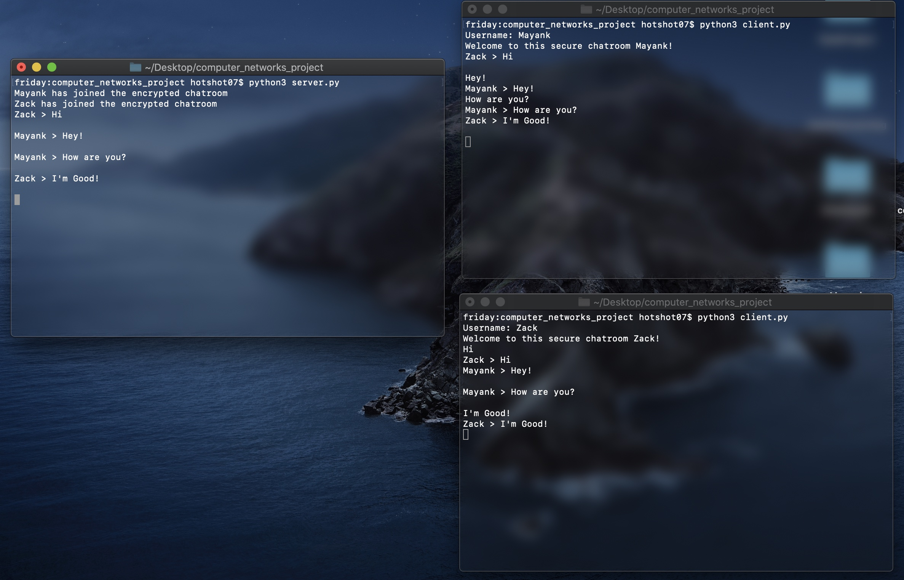

# Computer Networks Project

For my computer networks module in Trinity College Dublin, I have made a multithreaded chat application that sends messages to users instantly. I'm now working on adding security features like AES Encryption to the application.

Current Progress

